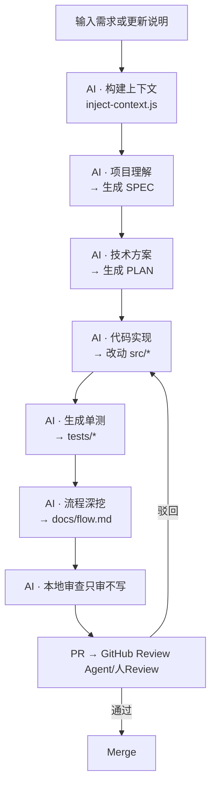

# 在VScode中搭建 Copilot × Codex 智能协作工作流（可根据自己的agent调整）
> 一个基于 **GPT-5 Codex + GitHub Copilot** 的全自动 AI 编程工作流模板。  
> Codex 负责生产，Copilot 负责审查。

## 🧭 一、核心理念

1. **上下文先行**：AI 的聪明取决于你喂的**上下文**。
2. **一步一停**：每次只执行一个最小任务单元。
3. **文件为契约**：所有交接都通过 JSON + Markdown 文件。
4. **AI 不替人决策**：AI 写文档、写代码、提审；人类**定方向、审质量、放行**。
5. **CI 是裁判**：所有 [BLOCKER] 与契约不符的改动，自动阻断。

整个系统的循环节奏是：
需求进入 → 构建上下文 → 生成 SPEC → 生成 PLAN
   ↓
拆任务 → 实现子任务 → 自动测试 → 另一个agent审查 → 提交代码

## 二、整体 AI 工作流图

## 三、目录结构总览
AiCodeWorkFlow/
│
├── .vscode/
│   └── tasks.json                      # VSCode 任务工作流配置（触发每个阶段）
│
├── scripts/
│   └── ai/
│       ├── codex-run.js                # 通用执行器：注入 prompt + rule + context
│       ├── inject-context.js           # 从 docs/spec/src 构建上下文摘要
│       ├── review-local.js             # 本地只审不写审查
│       └── provider.js                 # 模型调度：Codex / Copilot / Claude / Perplexity
│
├── .prompts/
│   ├── 01_project_understanding.md     # 项目理解 → SPEC
│   ├── 02_solution_design.md           # 技术方案/设计 → PLAN
│   ├── 03_code_impl.md                 # 代码实现
│   ├── 04_unit_test.md                 # 单元/契约测试
│   ├── 05_flow_analysis.md             # 流程分析文档
│   └── 99_research.md                  # 深度研究
│
├── rules/
│   ├── RULES_docs_spec.md              # SPEC 生成规范
│   ├── RULES_solution_spec.md          # 技术方案规范
│   ├── RULES_task_generation.md        # 任务拆分规范
│   ├── RULES_ts_dev_guidelines.md      # TS 开发规范
│   ├── RULES_middleware_ts.md          # 中间层规范
│   ├── RULES_flow_analysis.md          # 流程分析规范
│   └── RULES_review_spec.md            # 审查规范（只审不写）
│
├── spec/
│   ├── SPEC.md                         # 自动生成：需求规格
│   ├── PLAN.md                         # 自动生成：技术方案
│   └── TASKS.md                        # 自动生成：任务拆分
│
├── docs/
│   ├── 方案设计.md                      # 深度版方案设计
│   ├── research.md                     # 深度研究报告
│   └── *-flow.md                       # 自动生成：流程分析
│
├── src/                                # 业务源代码（Codex 自动修改区）
│   └── index.ts
│
├── tests/                              # 自动生成：单测/契约测
│   └── sample.test.ts
│
├── .github/
│   └── workflows/
│       └── ai-review.yml               # GitHub “只审不写” 自动审查
│
├── package.json                        # 所有 npm 脚本定义（ai:xxx）
└── README.md                           # 仓库说明 / 工作流介绍

## 四、执行循环（执行代理与审查代理职责）
| 阶段   | 模型/Agent          | 作用           | 输入                                       | 输出                 |
| ---- | ----------------- | ------------ | ---------------------------------------- | ------------------ |
| 需求分析 | Codex             | 理解上下文生成 SPEC | 上下文 + 01 + rules/docs_spec               | `spec/SPEC.md`     |
| 技术方案 | Codex             | 架构/方案设计      | `SPEC.md` + 02 + rules/solution_spec     | `spec/PLAN.md`     |
| 代码实现 | Codex             | 按 TASK 执行    | `PLAN.md` + 03 + rules/ts_dev_guidelines | 修改 `src/*`         |
| 单测生成 | Codex             | 自动生成测试       | 改动代码 + 04 + rules/ts_dev_guidelines      | `tests/*`          |
| 流程分析 | Codex             | 生成流程文档       | 源码 + 05 + rules/flow_analysis            | `docs/*-flow.md`   |
| 深度研究 | Claude/Perplexity | 技术对比/选型      | 上下文 + 99 + rules/solution_spec           | `docs/research.md` |
| 审查   | Copilot           | 只审不写         | 所有产物 + rules/review_spec                 | PR 评论              |

## 五、使用心诀

- **启动前**：先写清需求，Codex 不猜。
- **生成时**：多用编号化问题，少用模糊词。
- **实现时**：锁定 scope，单步推进。
- **审阅时**：用 `[BLOCKER]/[RISK]/[NICE]` 打标签。
- **维护时**：让 CI 做“坏消息传递者”。