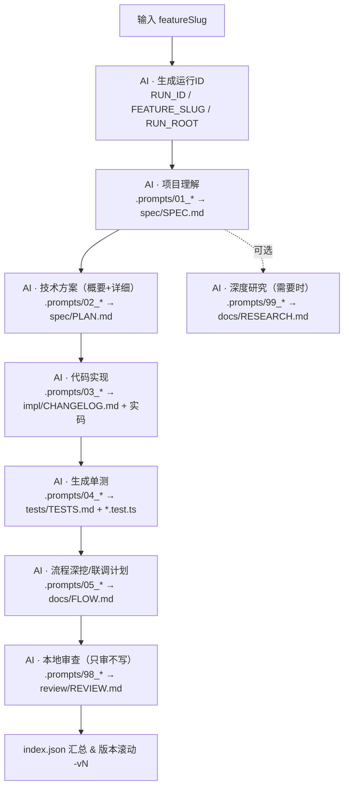

# 🧠 AiCodeWorkFlow · 全链路 AI 开发流水线（TypeScript）

> 让 AI 成为“有边界、有契约”的搭档：从**需求输入**到**代码、测试、联调、审查**，一条命令跑完；每次运行独立落盘、可回溯、不覆盖历史。
> 支持 VS Code / Copilot / Codex / Claude / MCP；默认 TypeScript 项目结构与规范。

---

## 🎯 这个仓库解决什么问题？

* 把传统研发从**“写文档/写代码/写测试/开会联调/代码走查”**的散点作业，变为**串联的自动化流水线**；
* 在每一环增加**输出契约**（Output Contract），明确产出物和验收标准；
* 所有阶段产物按**运行实例 RUN_ROOT** 隔离：`runs/<RUN_ID>-<FEATURE_SLUG>/…`，**绝不覆盖历史**；
* **仅审不写的审查 Agent**独立运行，确保“编码 Agent 不自评”。

---

## 🧱 全链路一图流



> **联调定位**：通过 `docs/FLOW.md` 输出**接口/时序/依赖**的联调计划与检查清单，结合单测与本地/容器服务进行验证。必要时触发 `AI · 深度研究` 对外部依赖/方案做 Quick Research。

---

## 🗂️ 目录与产物

```
AiCodeWorkFlow/
├─ .vscode/tasks.json                # VS Code 一键全链路任务
├─ .prompts/                         # 各阶段 Prompt 模板（含输出契约）
│   ├─ 01_project_understanding.md   # 需求理解/上下文归纳 → SPEC.md
│   ├─ 02_solution_design.md         # 概要+详细方案 → PLAN.md
│   ├─ 03_code_impl.md               # 代码落地指导 → CHANGELOG.md + 实码
│   ├─ 04_unit_test.md               # 测试策略+示例 → TESTS.md + *.test.ts
│   ├─ 05_flow_analysis.md           # 时序/联调计划 → FLOW.md
│   ├─ 98_review_only.md             # 仅审不写 → REVIEW.md
│   └─ 99_research.md                # 深度研究 → RESEARCH.md（可选）
├─ rules/                            # 规则与准入（模型的“护栏”）
│   ├─ RULES_docs_spec.md            # SPEC 文档规范（WHAT）
│   ├─ RULES_solution_spec.md        # PLAN 方案规范（HOW）
│   ├─ RULES_ts_dev_guidelines.md    # TS 工程规范/目录/接口/异常/日志等
│   ├─ RULES_flow_analysis.md        # 流程/时序/联调产物规范
│   └─ RULES_review_only.md          # 审查只读规范（禁止编码）
├─ scripts/ai/                       # AI 执行脚本（全部走 RUN_ROOT）
│   ├─ runid.js                      # 生成 RUN_ID → .ai-runid
│   ├─ env.js                        # 计算 RUN_ROOT / join / export
│   ├─ inject-context.js             # 递归扫描上下文 → context.cache.md
│   ├─ render-template.js            # 注入 {{RUN_ID}}/{{FEATURE_SLUG}}/{{RUN_ROOT}}
│   ├─ codex-run.js                  # LLM 执行器（支持 rules 目录/滚动版本 -vN）
│   ├─ review-local.js               # 仅审不写报告
│   └─ update-run-index.js           # 汇总 runs/*/index.json
├─ runs/                             # 每次运行隔离目录（自动生成）
│   └─ 20251019-153012-feature-x/
│       ├─ spec/SPEC.md | PLAN.md | PLAN-v2.md
│       ├─ impl/CHANGELOG.md
│       ├─ tests/TESTS.md | *.test.ts
│       ├─ docs/FLOW.md | RESEARCH.md
│       ├─ review/REVIEW.md
│       └─ index.json
├─ .github/
│   ├─ workflows/ai-review.yml       # PR 审查（阻断 Blocker）
│   └─ copilot-instructions.md       # Copilot 使用约定
├─ package.json
└─ README.md
```

---

## 🚀 快速开始（VS Code 任务面板）

**第一步：输入需求别名（featureSlug）并生成运行实例**

* 运行：`AI · 生成运行ID`

  * 目的：生成 `RUN_ID`、拼出 `RUN_ROOT=runs/<RUN_ID>-<FEATURE_SLUG>`，保证隔离与可回溯。

**第二步：一键全链路**

* 运行：`AI · 全链路`（或分步执行各阶段任务）

  * 作用：按顺序执行：项目理解 → 方案 → 实现 → 单测
  * 产出：所有文件自动落盘到 `RUN_ROOT`，绝不覆盖历史（同名自动 `-vN`）。

> 命令行也可执行（示例）：

```bash
# 构建上下文（递归扫描 src/docs/spec/rules）：
npm run ai:ctx:build

# 逐步执行
npm run ai:understand
npm run ai:solution
npm run ai:impl
npm run ai:test
npm run ai:flow
npm run ai:review:local

# 需要外部技术调研时：
npm run ai:research
```

---

## 🧬 各阶段说明（做什么 & 为什么）

### 1) 项目理解（需求分析 / Context Build）

* 任务：聚合**项目上下文 + 现有代码结构 + 需求摘要**
* 产出：`spec/SPEC.md`（WHAT，避免直接写代码时“理解错题”）
* 为什么：把“需求共识”固化成契约，后续任何偏差都能追责回溯。

### 2) 技术方案（概要设计 + 详细设计）

* 任务：将 SPEC 的 WHAT 转为 HOW（模块图/时序/接口/边界/退路）
* 产出：`spec/PLAN.md`（包含任务拆分建议与验收标准）
* 为什么：让代码生成“有图纸”，同时定义**联调接口契约**与测试针脚。

### 3) 代码落地（实现计划 → 改动说明）

* 任务：在 `PLAN` 指导下生成/修改代码；产出改动说明
* 产出：`impl/CHANGELOG.md`（可选同时生成代码补丁/文件清单）
* 为什么：让“代码行为”与“方案图纸”一一对应，支持 Code Review 审计。

### 4) 单测（含样例/Mock/覆盖策略）

* 任务：根据 PLAN 的接口定义和案例生成 `.test.ts` 与 `TESTS.md`
* 产出：`tests/TESTS.md` + `tests/**/*.test.ts`
* 为什么：把**可运行的验证**纳入契约，联调前先在测试层“跑通关键路径”。

### 5) 流程深挖 & 联调计划

* 任务：输出**时序图 / 依赖图 / 联调清单 / 验收脚本**
* 产出：`docs/FLOW.md`（Mermaid + 步骤）
* 为什么：把“联调需要的协同细节”结构化，避免站会口输反复。

### 6) 本地审查（只审不写）

* 任务：独立 Reviewer Agent 基于 `rules` 对全部产物进行一致性审查
* 产出：`review/REVIEW.md`（包含 ✅/⚠️/❌，以及阻断项原因）
* 为什么：坚决避免“编码 Agent 自评自审”的偏差与风险。

### 7) 深度研究（可选）

* 任务：检索外部资料/方案/竞品/最佳实践，归档证据
* 产出：`docs/RESEARCH.md`
* 为什么：在遇到技术选型/性能/安全等难题时，提供**有出处**的参考。

---

## 🔒 不覆盖与版本滚动

* 所有产物写入前，执行器会检测是否重名：
  存在 → 自动写 `-vN`（`SPEC.md → SPEC-v2.md → v3…`），**历史不丢失**。
* 每次全链路运行使用唯一 `RUN_ID`，构成独立 `RUN_ROOT`；不同需求/不同时间完全隔离。

---

## 🧠 与 Copilot / Codex / Claude 的关系

* **执行器**（`scripts/ai/codex-run.js`）是**适配层**：
  你可以替换为任意模型/代理（Copilot / OpenAI / Claude / 本地 LLM / MCP），
  但**输出契约**与**路径规范**不变，保证“可替换而不破坏流水线”。

* **规则**（`rules/*.md`）是“**护栏**”：
  强制模型在 TS 风格、错误处理、日志、接口一致性等方面按规范输出。

---

## 🧪 本地联调建议（可与 ⑤ 配合）

* 运行本地服务/Mock（如 `pnpm dev`、`docker compose up -d`）；
* 用 `docs/FLOW.md` 的**联调清单**逐项验证；
* 对每个接口执行**合约测试**（可将 `tests/*.test.ts` 延伸为 **API 测试**）；
* 将问题与修复写回 `impl/CHANGELOG.md` 的“修复记录”区块，保持闭环。

---

## 🔧 常用命令

```bash
# 构建上下文
npm run ai:ctx:build

# 需求理解 → 方案 → 实现 → 单测（逐步）
npm run ai:understand
npm run ai:solution
npm run ai:impl
npm run ai:test

# 流程深挖（联调计划）
npm run ai:flow

# 仅审不写（阻断项不会自动修复）
npm run ai:review:local

# 需要时的研究
npm run ai:research
```

> VS Code 里也可通过任务面板同名任务点击执行；首次会弹出 `featureSlug` 输入框，例如：`order-refund-v2`。

---

## 🧭 CI / PR 审查（可选）

* `.github/workflows/ai-review.yml` 会在 PR 中自动执行“只审不写”；
* 若存在 **❌ 阻断项**，可以配置**阻止合并**；
* 建议结合 **Conventional Commits** 与 **语义化版本** 做变更与发布。

---

## 📌 设计取舍

* **以文件为中心**：所有产物可读可 diff，可复制到任意知识库；
* **契约优先**：先固化 SPEC/PLAN，再让 AI 按图施工；
* **强隔离**：RUN_ROOT + `-vN` 双保险，不会覆盖历史；
* **人机协作**：审查 Agent 独立，避免“写的人自己审”。

---

## 📝 License

MIT © 2025 Krys Liang

> “不是让 AI 替你思考，而是让 AI 在**你的流程**里正确地干活。”
