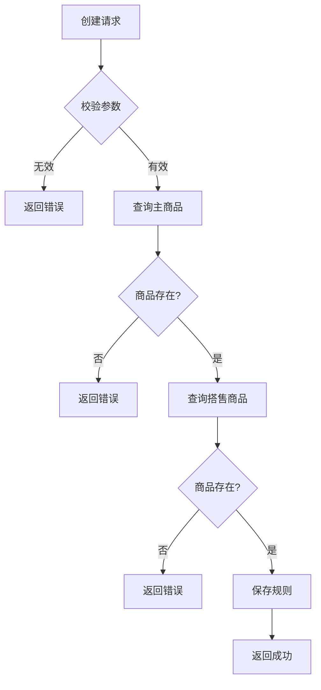

# 项目文档规范

**文档受众明确为软件开发人员**，目的是帮助开发团队快速理解系统架构、业务逻辑和技术实现细节，便于代码维护、功能扩展和知识传递。
## 关键规则
- 项目文档必须包含四个核心部分：项目简介、核心领域模型、项目结构和外部依赖
- 接口文档必须按照@接口文档规范进行编写和维护
- 业务流程文档必须按照@业务流程文档规范进行编写和维护
- 文档应保持客观性，基于现有代码而非理想状态
- 文档中使用的术语必须与代码中的术语保持一致
- 文档应使用Markdown格式，支持图表、表格和代码块
- 代码示例必须是从实际代码中提取的，而非虚构的
- 图表应使用Mermaid或PlantUML语法，以确保可维护性
- 文档应当引用具体的代码文件路径，便于读者查找相关实现
- 首先判断项目是否使用GBF框架，并根据实际架构选择适合的文档结构和内容
- 所有文档必须统一放置在docs目录下，并使用规定的中文名称
- **文档生成过程中必须确保完整覆盖所有内容，不允许任何遗漏**
## 文档优化与结构指南
- **主索引文档**：每个核心部分创建一个主索引文档，包含子文档链接和简要说明
- **文档内导航**：超过500行的文档必须在开头提供目录
- **分层结构**：按照"金字塔结构"组织（顶层：核心概念；中层：主要功能模块；底层：具体实现细节）
- **文档拆分**：接口超过20个时按业务域拆分；核心实体超过10个时按业务领域拆分
## 文档结构和内容要求
### 1. 项目简介 - docs/项目概述.md
必须包含：项目背景、项目目标、功能概述、技术栈和架构类型（明确是否使用GBF框架）
### 2. 核心领域模型 - docs/领域模型说明.md
必须包含：
- 领域模型概述：核心业务概念的定义和边界
- 核心实体关系图：使用E-R图或类图表示
- 关键业务场景下的模型交互
- 数据流转关系
**强制性领域模型扫描规则**：
- **全面扫描**：包括`*Entity.java`、`*DO.java`、`*PO.java`、`*Model.java`、`@Entity`、`@Table`、`@Document`注解类、服务层核心模型、DTO/VO类
- **按目录结构识别**：位于`model`、`domain`、`entity`目录及其子目录下的Java类文件，以及领域模型专用包路径（如`*.domain.*`、`*.model.*`、`*.entity.*`）下的类文件
- **完整提取**：实体属性和业务含义、实体关系、聚合结构、生命周期和状态流转
- **识别规则**：属性约束、实体关系约束、状态转换规则
**领域模型分析策略**：
- 全域扫描实体类和值对象，支持多种ORM框架
- 提取关联关系（通过字段类型、泛型参数和ORM注解）
- 识别聚合根和聚合边界（通过包结构和类间关系）
- 分析继承结构（包括抽象类、接口和实现类）
- 提取业务方法和状态转换逻辑
- 生成完整属性表和业务规则说明
**GBF框架项目补充**：扩展点定义与实现、行业/场景定制点、路由条件与动态选择机制
### 3. 接口文档 - docs/接口文档.md
接口文档应遵循专门的@接口文档规范进行创建和维护，以确保API接口的完整记录和更新。
### 4. 业务流程 - docs/业务流程说明.md
业务流程文档应遵循专门的@业务流程文档规范进行创建和维护，以确保业务流程的完整记录和更新。
### 5. 项目结构 - docs/项目结构说明.md
必须包含：项目模块划分、代码组织结构、关键包说明、分层架构说明
**GBF框架项目补充** - docs/GBF框架应用说明.md：
GBF分层结构、扩展点文件位置、行业定制目录、场景定制目录
### 6. 外部依赖与下游服务 - docs/外部依赖说明.md
必须包含：
- 下游服务概述：依赖的所有外部服务列表和用途
- 调用关系图：系统与外部服务的调用关系
## 文档生成工作流程
1. **架构识别**：确定项目架构类型、识别关键组件和分层结构
2. **代码分析**：识别核心业务包和类、分析领域模型、提取接口定义、理解调用链路
3. **内容整理**：按文档结构组织信息、提取代码示例、绘制图表
4. **审核完善**：验证文档与代码一致性、补充关键信息、完善图表和示例
   - **接口覆盖性验证**：确认总览文档中的所有接口都在详细文档中有完整描述
   - **文档完整性检查**：确保没有遗漏任何必要的接口和服务描述
5. **定期更新**：与代码审查流程集成、重大变更更新文档、每季度全面审核
## 示例
### 领域模型示例
```markdown
## 核心实体关系图
```mermaid
classDiagram
  classItem {
    +Long id
    +String name
    +BigDecimal price
    +String status
    +validatePrice()
    +changeStatus(String)
  }
  
  classTyingRule {
    +Long id
    +Long mainItemId
    +List<Long> subItemIds
    +Date startTime
    +Date endTime
    +enable()
    +disable()
  }
  
  Item "1" -- "n" TyingRule: 被定义为主商品
  TyingRule "1" -- "n" Item: 关联搭售商品
```
## 实体属性详细说明
### Item 商品实体
| 属性名 | 类型 | 说明 |
|----|---|---|
| id | Long | 商品唯一标识 |
| name | String | 商品名称，长度限制：2-50个字符 |
| price | BigDecimal | 商品价格，精确到小数点后2位，最小值：0.01 |
| status | String | 商品状态，枚举值：ON_SHELF(上架)、OFF_SHELF(下架)、DELETED(删除) |
#### 业务规则
- 商品价格必须大于0
- 商品状态只能按特定流程转换（上架->下架->删除）
```
### 业务流程示例
```markdown
## 搭售规则创建流程
### 核心流程图

### 调用链路
**入口点**: `ItemTyingController.createTyingRule()`
**调用流程**:
1. 请求参数校验 - `validateTyingRequest(request)`
2. 查询主商品信息 - `itemService.getItemById()`
3. 校验主商品状态 - `validateItemStatus(item)`
4. 查询并校验搭售商品列表 - `validateSubItems()`
5. 构建并保存搭售规则 - `tyingRuleRepository.save()`
6. 发送规则创建事件 - `eventPublisher.publishEvent()`
### 关键判断点
| 判断点 | 条件 | 处理路径 |
|-----|---|----|
| 参数校验 | 主商品ID为空 | 返回参数错误 |
| 主商品校验 | 主商品不存在 | 返回商品不存在错误 |
| 搭售商品校验 | 存在无效商品 | 返回商品无效错误 |
两个rule可以亲自试试效果，第二个描述规范了Cursor要深入检索，但是目前免费能用的模型很难做到，新出来的Claude4.0可以完成复杂任务的分析研究。


梳理项目Rule

# 代码分析规则

## 目标
根据代码入口深入分析完整业务流程，生成详细的业务流程文档，便于团队理解和维护代码。
## 关键规则
- **必须生成分析文档保存到项目的docs目录下**
- **必须使用sequential-thinking辅助分析**
- **必须深入方法内部逻辑，因此你可能需要检索代码**
- **建议使用sequential-thinking辅助检索代码**
### 1. 聚焦业务核心逻辑
- 忽略日志打印、参数基础校验等次要逻辑
- 忽略异常处理中的技术细节，只关注业务异常处理逻辑
- 忽略与业务无关的工具方法调用（如字符串处理、集合操作等）
- 聚焦业务状态转换、流程分支、核心计算等关键逻辑
### 2. 深入方法调用链
- 追踪每个关键方法的内部实现，不仅停留在方法调用层面
- 对调用链上的每个重要方法都分析其内部业务逻辑
- 对于外部依赖的服务（如HSF、RPC调用），说明其功能和业务意义
- 深入分析每个关键业务分支的条件和处理逻辑
### 3. 结合已有文档
- 优先使用已有文档中的描述，避免重复分析
- 如果已有文档对某个方法有详细描述，直接引用该内容
- "站在巨人的肩膀上"，基于已有文档进行补充和完善
- 对已有文档与代码实现不一致的地方进行标注
### 4. 文档输出规范
- 分析结果保存到 `/docs` 目录下，使用 Markdown 格式
- 文档命名格式：`业务名称-流程分析.md`（如：`订单创建-流程分析.md`）
- 文档需包含方法调用树，清晰展示调用层级关系
- 使用分步业务流程描述完整处理过程
## 文档结构模板
```markdown
# 业务名称流程分析
## 功能概述
[简要描述该业务功能的目的和作用]
## 入口方法
`com.example.Class.method`
## 方法调用树
```
入口方法
├─ 一级调用方法1
│  ├─ 二级调用方法1.1
│  ├─ 二级调用方法1.2
├─ 一级调用方法2
   ├─ 二级调用方法2.1
   └─ 二级调用方法2.2
      └─ 三级调用方法
```
## 详细业务流程
1. [步骤1：业务逻辑描述]
2. [步骤2：业务逻辑描述]
   - [子步骤2.1：详细逻辑]
   - [子步骤2.2：详细逻辑]
3. [步骤3：业务逻辑描述]
## 关键业务规则
- [规则1：描述业务规则及其条件]
- [规则2：描述业务规则及其条件]
## 数据流转
- 输入：[描述方法输入及其业务含义]
- 处理：[描述关键数据处理和转换]
- 输出：[描述方法输出及其业务含义]
## 扩展点/分支逻辑
- [分支1：触发条件及处理逻辑]
- [分支2：触发条件及处理逻辑]
## 外部依赖
- 标注对外部系统的依赖
## 注意事项
- [列出实现中需要特别注意的点]
```
## 系统交互图
- 如果业务流程包含多个系统模块，请使用PlantUML画出时序图
## 代码分析技巧
### 步骤1：明确业务入口
- 确定代码分析的起点（通常是Controller、Facade或Service层的公开方法）
- 了解该方法的调用场景和业务背景
### 步骤2：构建方法调用树
- 从入口方法开始，追踪所有重要的方法调用
- 使用缩进表示调用层级，清晰展示调用关系
- 忽略非核心方法调用（如日志、参数校验等）
### 步骤3：分析业务流程
- 按照代码执行顺序分析业务处理步骤
- 重点关注业务状态转换和分支逻辑
- 提取关键业务规则和数据处理逻辑
### 步骤4：整理业务规则
- 总结条件判断中隐含的业务规则
- 分析不同场景下的处理差异
- 提炼业务逻辑的核心决策点
### 步骤5：描述数据流转
- 分析关键数据的来源、处理和去向
- 说明数据模型转换和业务含义
- 关注核心业务实体的状态变化
## 示例分析
参考 [订单查询.md](/docs/订单查询.md) 文档了解完整的分析示例:
该示例展示了订单查询业务的完整分析，包括:
- 方法调用树展示了完整调用链
- 详细业务流程按步骤拆解
- 关键业务规则清晰列出
- HSF接口等外部依赖明确说明
- 特殊处理逻辑如推广通退款按钮透出详细解释
## 好的分析的特征
1. **完整性**：覆盖所有核心业务逻辑和分支
2. **层次性**：清晰展示处理流程的层次结构
3. **业务性**：以业务视角描述，而非技术实现细节
4. **精确性**：准确反映代码的实际处理逻辑
5. **可理解性**：业务人员也能理解的表述方式
6. **实用性**：帮助读者快速理解业务流程和规则 